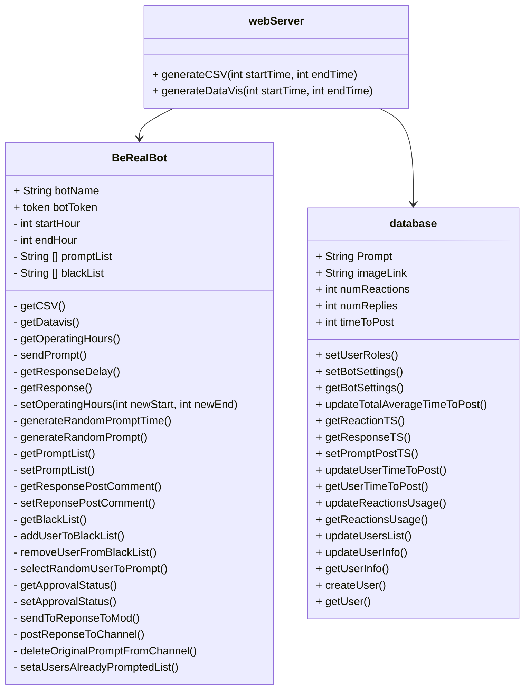
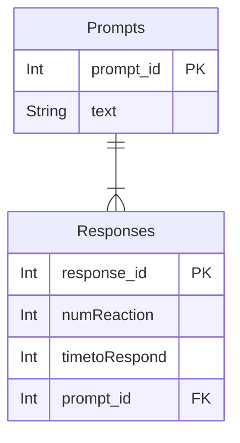
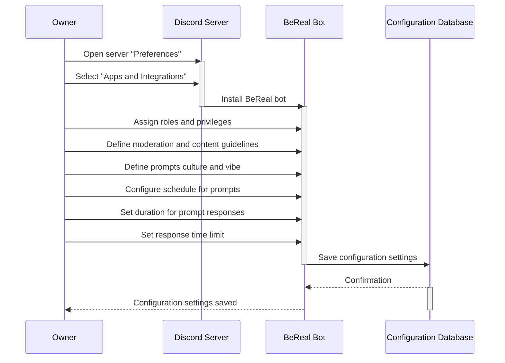
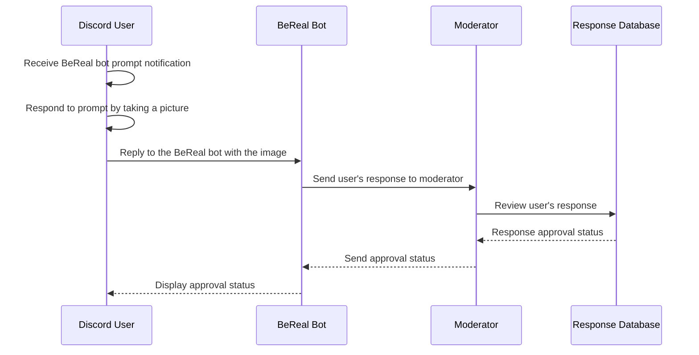
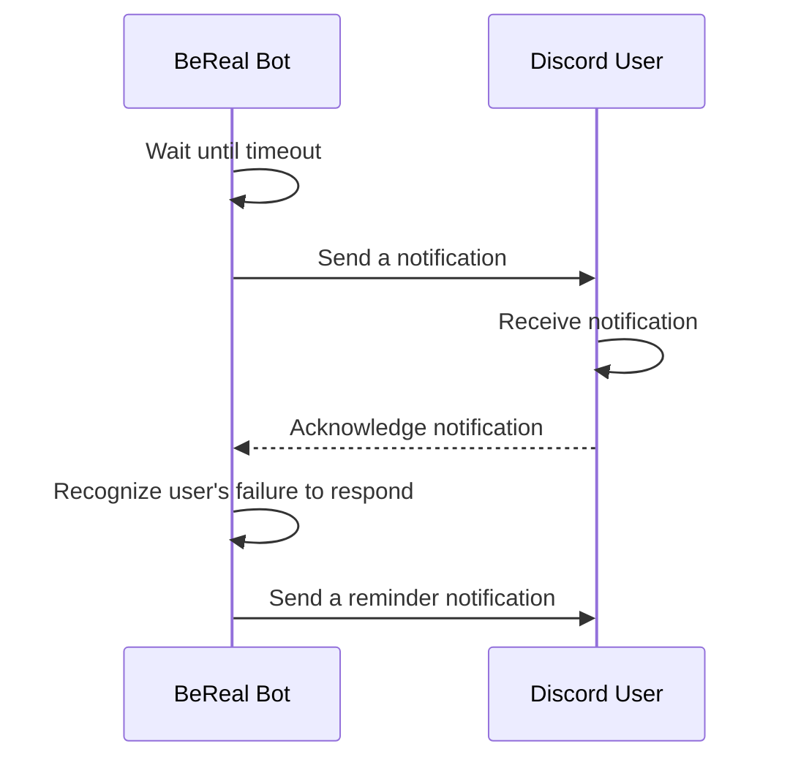
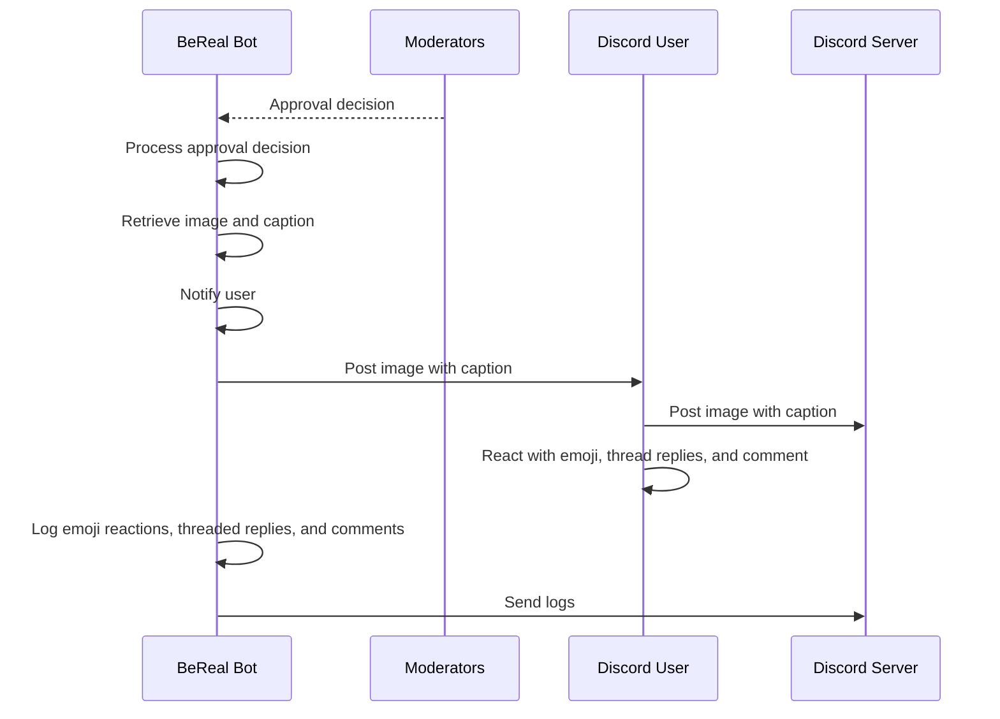
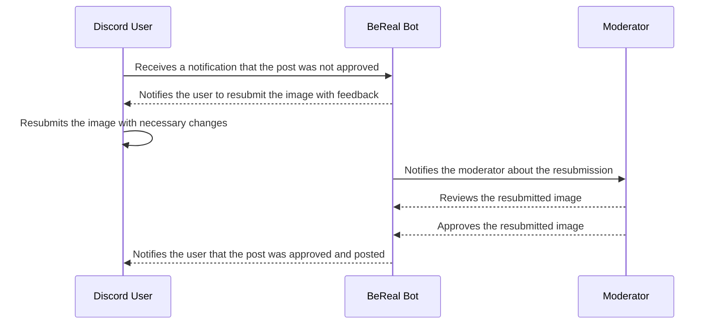
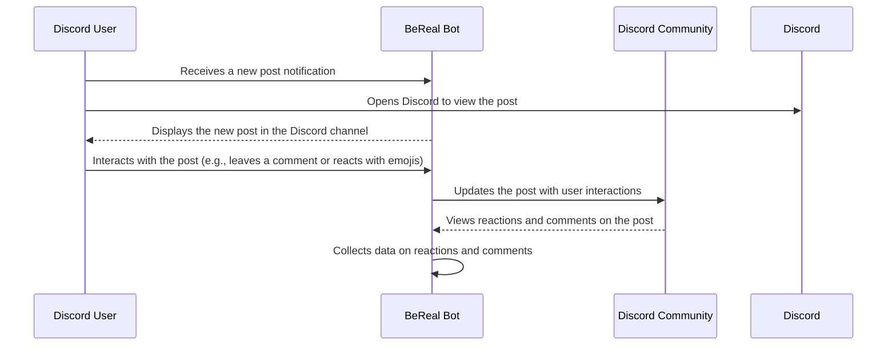

# BeReal Bot Design Document

## Components

### Chat Application

The chat application acts as both the user portal for the bot and as the running environment for the bot. The chat application facilitates user interaction with the bot and allows for it to act like a psuedo user that can post and interact with messages. There will be a level of UI/UX design for the bot in Discord using both its API & libraries for command and interaction formatting as well as block kit for formatting of modals, popups, and responses. The application will also act as the display for all data visualization that moderators ask for.

### BeReal Bot 

The bot itself is a chatbot that is hosted on Google Cloud via cloud run, as mentioned previous it will act as a pseudo user posting messages and accepting/reacting to user responses with triggers. It interfaces with the Discord API to send messages, and interfaces with the database to both store and pull user reaction data. When dealing with moderation the bot will opt to DM moderators and generate either popups, modals, or interfaceable actions for approvals, data requests, or moderation features. When logging data the bot will leverage the server to send data to firebase for storage.

### Google Cloud Webserver

The Google Cloud webserver provides a hosting point for the bot using the cloud run service. The server allows for two things, bot uptime and bot access to the database, through the server the bot can make calls to the firebase database both for logging and for acces of data. The webserver will also provide containers that host the firebase database for reaction data. The webserver will also be responsible for handling the formatting of data into visualizations when requested by the bot via a user.

### Google Firebase Database

The Firebase database is contained in the cloud webserver and acts as a means of storing and logging all reaction data. The database will contain data pertaining to prompts, approved submitted images, time to post, emoji reactions, threaded replies, and number of comments. All of this data will be exportable as a CSV or in a visualization done by the host webserver.

## Class Diagram

## BeReal Bot
This class will contain methods that allow the bot to interact with the users and moderator

**Fields**

  **-botName**: Display name for the bot and how users and other members of the platform will recognize and refer to the bot

  **- botToken**: Unique access token or authentication key that allows the bot to connect to the platform’s API and perform actions

  **- startHour**: Hour of when the bot will start 

  **- endHour**: Hour of when bot will end

  **- promptList**: List of all the prompts the bot can choose from

  **- blackList**: List of users on the blacklist

**Methods**

  **-getCSV()**: Gets the CSV fields

  **-getDatavis()**: Checks for CSV fields by parsing lines from a file

  **-getOperatingHours()**: Gets the operation hours of the bot

  **-sendPrompt()**: Sends a prompt to a user

  **-getResponseDelay()**: Gets the time it takes when the bot has to resend a prompt to the user

  **-getResponse()**: gets response from the user

  **-setOperatingHours(int newStart, int newEnd)**: Sets the operating hours

  **-generateRandomPromptTime()**: Generates a random time for when prompts are assigned

  **-generateRandomPrompt()**: Generates a random prompt

  **-getPromptList()**: Gets the prompt list

  **-setPromptList()**: Sets the prompt list 

  **-getResponsePostComment()**: Gets and stores the response of a post comment

  **-setReponsePostComment()**: Sets a response of a post comment

  **-getBlackList()**: Shows the blacklist

  **-addUserToBlackList()**: Adds users to the blacklist

  **-removeUserFromBlackList()**: Removes a user from the blacklist

  **-selectRandomUserToPrompt()**: Selects a random user to assign a prompt to

  **-getApprovalStatus()**: Gets the approval status after sending a user response to the moderator

  **-setApprovalStatus()**: Sets the approval status after sending a user response to a moderator

  **-sendToReponseToMod()**:  Sends a user response to a prompt to a moderator

  **-postReponseToChannel()**: Posts the response of a moderator to a user to a channel

  **-deleteOriginalPromptFromChannel()**: Deletes a prompt from a certain channel

  **-setaUsersAlreadyPromptedList()**: Sets a list of users that were already prompted by the bot
  

## Algorithms

## Database Diagrams

## Sequence Diagrams

**Use Case #1**: Owner of the Discord Server Configures the BeReal bot

Use Case 1 Discription

  
  1. Owner signs in to Discord.
  2. Owner opens the server "Preferences". 
  3. Owner selects "Apps and Integrations" and installs the BeReal bot.
  4. Owner assigns roles and privileges to users in the community.
  5. Owner defines moderation and content guidelines.
  6. Owner defines type of prompts for BeReal bot to send properly suit the culture and vibe of their community.  
  7. Owner configures the schedule for BeReal bot, defining the hours when the it will send prompts.
  8. Owner sets the duration for prompt responses to remain in the chat.
  9. Owner sets the amount of time users have to respond to prompt notification.
  10. Owner saves the configuration settings.
      

  

**Use Case #2**: User Responds to a BeReal bot Prompt

Use Case 2 Discription

  
  1. User in the Discord community receives a notification at a random time of day that they have received a prompt from the BeReal bot
  2. User opens Discord.
  3. User responds to the random prompt by taking a picture and uploading it.
  4. User replies to the BeReal bot with their response to the prompt, which is sent to the moderator.
  5. User waits for approval status from the BeReal bot.
      

  

**Use Case #3**: User Does Not Respond to a BeReal bot Prompt

Use Case 3 Discription

  
  1. The BeReal bot waits until timeout The BeReal bot sends a notification to the Discord user
  2. BeReal bot recognizes the user’s failure to respond, and sends a reminder notification to the users about the missed prompt.
      

  

**Use Case #4**: User-Submission approved

Use Case 4 Discription

  
  1. BeReal bot receives the approval decision
  2. BeReal bot posts the image with the caption and notifies the user
  3. BeReal bot logs emoji reactions, threaded replies, and comments from the community
  4. BeReal bot sends logs to the server
      

  

**Use Case #5**: User’s submission is denied

Use Case 5 Discription

  
  1. User receives a notification that the post was not approved and is asked to resubmit with feedback
  2. User resubmits the image
  3. User receives a notification that the post was approved and it was posted
      

  

**Use Case #6**: User Reacts to a New Post Notification

Use Case 6 Discription

  
  1. A user in the Discord community is notified by the BeReal bot that another user has posted a response to a prompt.
  2. User opens Discord to view the response in the Discord community channel
  3. User interacts with the post by leaving a comment or a reaction(likes, emojis, etc)

  

## Document Requirements

**Purpose**

The Design Document - Part I Architecture describes the software architecture and how the requirements are mapped into the design. This document will be a combination of diagrams and text that describes what the diagrams are showing.

**Requirements**

In addition to the general requirements the Design Document - Part I Architecture will contain:

A description the different components and their interfaces. For example: client, server, database.

For each component provide class diagrams showing the classes to be developed (or used) and their relationship.

Sequence diagrams showing the data flow for _all_ use cases. One sequence diagram corresponds to one use case and different use cases should have different corresponding sequence diagrams.

Describe algorithms employed in your project, e.g. neural network paradigm, training and training data set, etc.

If there is a database:

Entity-relation diagram.

Table design.

A check list for architecture design is attached here [architecture\_design\_checklist.pdf](https://templeu.instructure.com/courses/106563/files/16928870/download?wrap=1 "architecture_design_checklist.pdf")  and should be used as a guidance.
